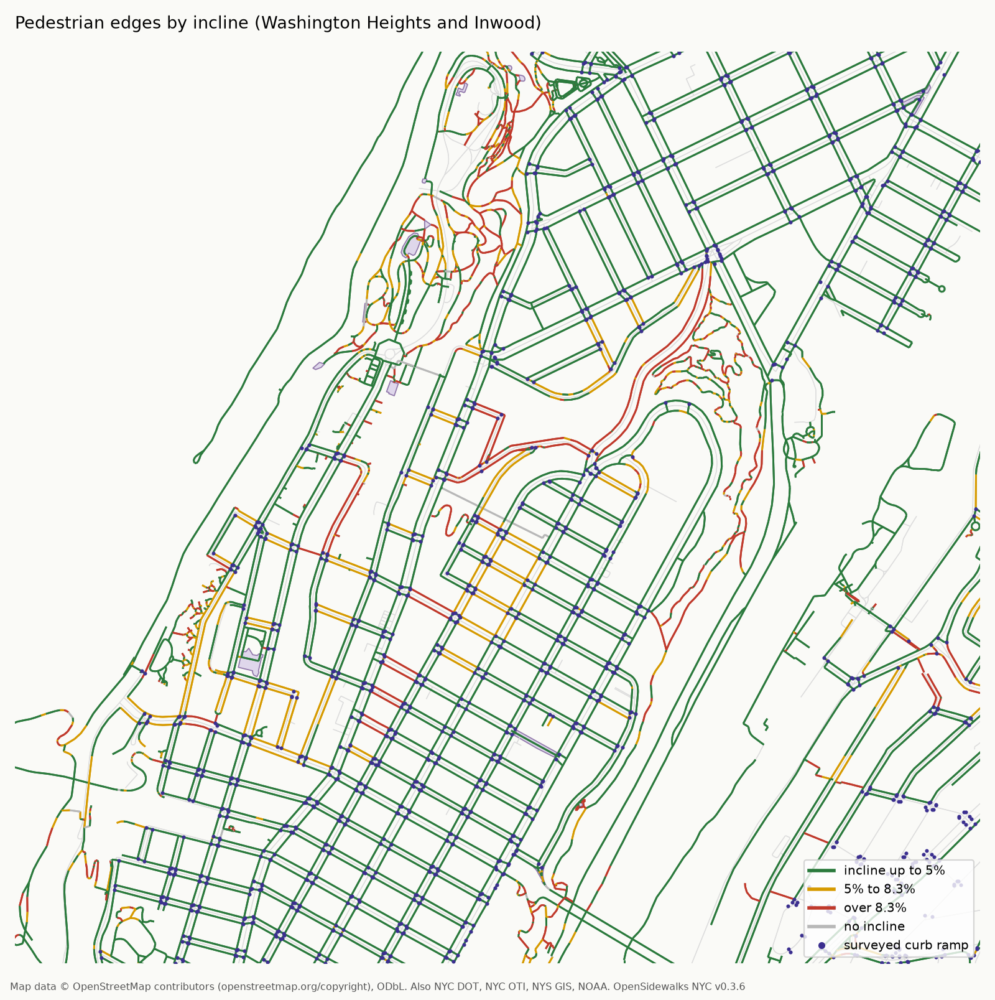
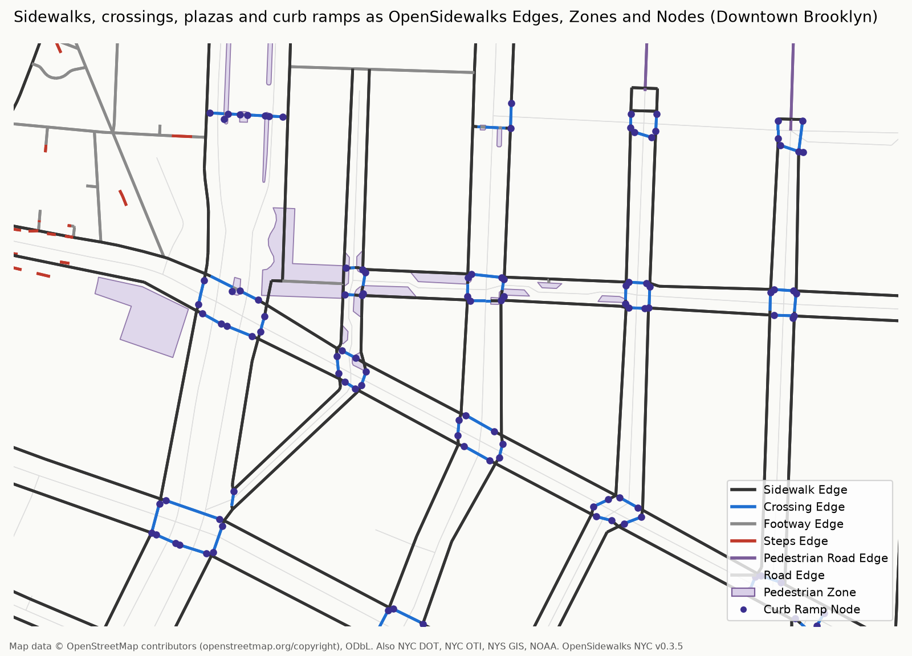
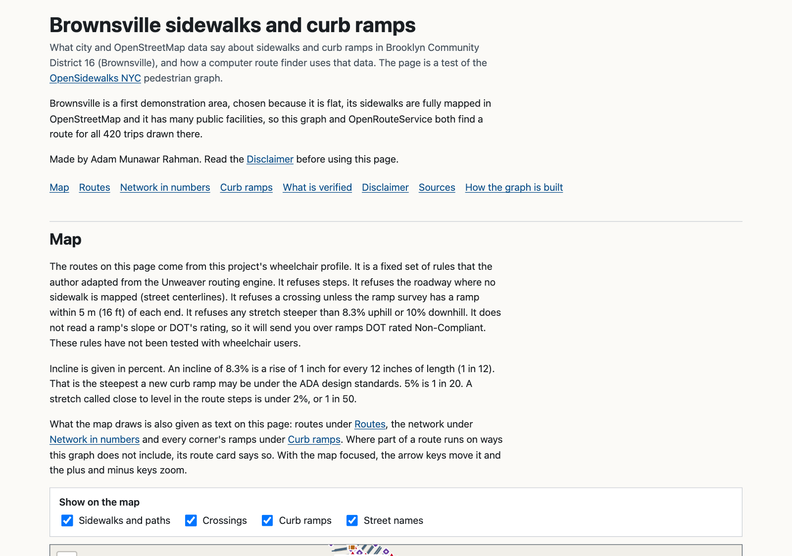
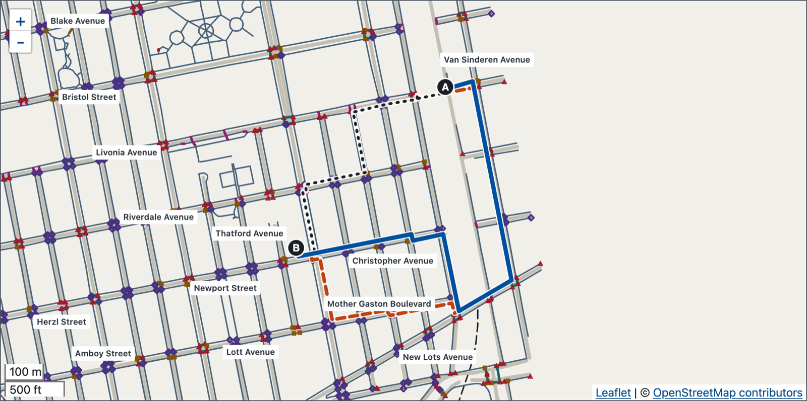

# OpenSidewalks NYC<!-- omit from toc -->

OpenSidewalks NYC is a data file of New York City's sidewalks, street crossings, plazas and curb ramps. It is for researchers who study street access and developers who build routing software. It is experimental: nothing in it has been checked on the ground. It is not a trip planner, and it does not say which routes are accessible.

It is an independent project. It uses the [OpenSidewalks Schema](https://github.com/OpenSidewalks/OpenSidewalks-Schema) v0.3, a shared format for pedestrian networks developed by the Taskar Center for Accessible Technology at the University of Washington. To report a problem, open a [GitHub issue](https://github.com/msradam/opensidewalks-nyc/issues). You need a free GitHub account, and what you write there is public.

[Demo](https://msradam.github.io/opensidewalks-nyc/) · [How it is built](https://msradam.github.io/opensidewalks-nyc/how-it-works.html) · [Download](https://github.com/msradam/opensidewalks-nyc/releases/latest) · [Evidence](evaluation/) · [Contributing](#contributing) · [Disclaimer](#disclaimer)



## Table of Contents<!-- omit from toc -->

- [Introduction](#introduction)
- [Dataset Contents](#dataset-contents)
	- [Edges](#edges)
	- [Zones](#zones)
	- [Nodes](#nodes)
	- [Fields](#fields)
	- [Network Topology](#network-topology)
	- [Known Deviations from the Schema](#known-deviations-from-the-schema)
- [Data Sources](#data-sources)
- [Download](#download)
- [Validation](#validation)
- [Evaluation](#evaluation)
	- [Comparison with Other Routers](#comparison-with-other-routers)
- [Brownsville Demo](#brownsville-demo)
- [Limitations](#limitations)
- [Related Work](#related-work)
- [Building the Dataset](#building-the-dataset)
- [Contributing](#contributing)
- [How This Was Made](#how-this-was-made)
- [Disclaimer](#disclaimer)
- [License and Attribution](#license-and-attribution)
- [Versions](#versions)

# Introduction

<a id="introduction"></a>

OpenSidewalks NYC is a pedestrian network of all five boroughs of New York City: sidewalks, street crossings, footways, pedestrian roads, plazas, steps, curb ramps and the streets between them. They are written as OpenSidewalks Nodes, Edges and Zones, so the file loads as a graph that routing software can search.

Following the OpenSidewalks approach, this dataset labels no path as wheelchair accessible. It stores values that an application can read against a person's own needs, with rules like "no incline greater than 8.3 percent". Only the curb ramp slopes are measurements, taken from NYC DOT's vehicle-based survey. Incline and width are estimates.

# Dataset Contents

<a id="dataset-contents"></a>

The dataset holds 3,995,589 features: 2,806,326 Edges, 1,187,062 Nodes and 2,201 Zones. Every Edge is directed, with `incline` signed in its direction of travel.



## Edges

<a id="edges"></a>

| Entity | Tags | Count |
|---|---|---|
| Sidewalk | `highway=footway`, `footway=sidewalk` | 933,174 |
| Crossing | `highway=footway`, `footway=crossing` | 437,940 |
| Footway | `highway=footway` with no `footway` subtag | 457,924 |
| Pedestrian Road | `highway=pedestrian`, a linear pedestrian street | 11,402 |
| Steps | `highway=steps` | 15,470 |
| Motor vehicle roads | `highway=residential`, `service`, `secondary`, `unclassified` and other road classes, with `ext:sidewalk` where OSM tags the street's sidewalks | 950,416 |

## Zones

<a id="zones"></a>

| Entity | Tags | Count |
|---|---|---|
| Pedestrian Zone | `highway=pedestrian`, a Polygon whose `_w_id` lists the Nodes of its outline | 2,201 |

A Pedestrian Zone is a plaza or another surface people walk across in any direction. OpenStreetMap maps these as closed ways tagged `area=yes`. Up to v0.3.4 this dataset wrote their outlines as Edges (73,700 Pedestrian Road and 9,944 Footway Edges), so a route went round a plaza. All 2,201 such areas are now the schema's Polygon entity, and the 11,402 Pedestrian Road Edges that remain are linear pedestrian streets. The GraphML, the routing JSON and the routing layer turn each Zone back into Edges: its outline, and a straight line between every two of its entrances that stays inside it. Each such Edge carries `ext:zone`.

## Nodes

<a id="nodes"></a>

| Entity | Tags | Count |
|---|---|---|
| Curb Ramp | `barrier=kerb`, `kerb=lowered`, with the NYC DOT survey fields | 217,679 |
| Curb nodes from OpenStreetMap | `barrier=kerb` with `kerb=lowered`, `raised`, `flush` or `rolled`, or alone (a generic curb) | 22,238 |
| Elevator | a Bare Node with `ext:osm_highway=elevator` | 137 |
| Bare Node | Edge endpoints and Zone outline vertices with no other entity type | 947,008 |

## Fields

<a id="fields"></a>

Edges carry `incline`, `width`, `surface`, `name`, `crossing:markings`, `foot` and `ext:structure`. `crossing:markings` comes from OSM's own `crossing:markings` tag, or from `crossing=*` as the schema advises. `foot` is OSM's tag, on 75,314 Edges. An OSM `path`, cycleway or track written as a Footway keeps its origin in `ext:osm_highway`. A street Edge carries what OSM says about the street's sidewalks in `ext:sidewalk` (`both`, `left`, `right`, `yes`, `no` or `separate`), on 344,718 of the 950,416 street Edges; the street stays a street Edge, and the routing layer's wheelchair profile walks one tagged as having a sidewalk. Curb nodes come from the DOT survey and, from v0.3.7, from OSM's own `kerb` nodes (22,238 nodes with `kerb=lowered`, `raised`, `flush` or `rolled`, or `barrier=kerb` alone); where a surveyed ramp sits on an OSM kerb node the survey's values win and OSM's stay in `ext:osm_kerb`. 137 elevator nodes carry `ext:osm_highway=elevator`, and the Edges at one have no `incline`. Curb Ramps carry `tactile_paving`, DOT's raw warning surface value in `ext:dws_condition`, and the survey's slopes. Nodes carry `ext:elevation_m`, except 1,538 that have no height: 1,306 are inside tunnels, 48 are on a structure with no deck height, and 184 are where the terrain model holds no data or outside its tiles. 2,042 Edges carry `ext:incline_unknown=yes` and no `incline`, because their two end heights give a grade no walkway is built at (0.5 or more, or over 1.0 on Steps). The mark means both heights were measured and are not a slope, so something changes level there. An Edge with no `incline` and no mark, such as a tunnel Edge, was not measured. A Curb Ramp's `ext:source` is `nyc_dot_ramps`, because its values come from the survey even where its position is an OpenStreetMap vertex. [SCHEMA.md](SCHEMA.md) lists every field.

## Network Topology

<a id="network-topology"></a>

The schema puts curb ramps at Edge endpoints and expects a Footway between a Sidewalk and a Crossing. OpenStreetMap's geometry, which this dataset keeps, joins many Crossings directly to Sidewalks: in Manhattan, 52% of the nodes on a Crossing also touch a Sidewalk (measured on v0.3.4). Each surveyed ramp is snapped to the end of a Crossing within 5 m when there is one, and otherwise to the nearest pedestrian Edge endpoint or Zone vertex within 5 m. 184,939 of the 217,679 ramps (85.0%) sit on such a vertex, 166,310 of them on a Crossing end (in v0.3.6, which took the nearest vertex, 55,347 of 181,499 attached ramps sat on a Sidewalk vertex beside their Crossing). The other 32,740 are on no Edge or Zone, because no vertex lies within 5 m or another ramp took it.

## Known Deviations from the Schema

<a id="known-deviations-from-the-schema"></a>

- Many Crossings join Sidewalks directly, with no Footway between them, and 32,740 Curb Ramp Nodes are on no Edge or Zone ([Network Topology](#network-topology)).
- OSM `highway=crossing` nodes are not marked, and a street tagged as having a sidewalk has no Sidewalk Edge: the tag is `ext:sidewalk` on the street.
- Both directions are stored, so applications must not add reverse Edges.
- A Pedestrian Zone has one outer ring and no interior detail, so a hole in a plaza (a fountain, a planter) is not written.

# Data Sources

<a id="data-sources"></a>

| Source | Contributes | License |
|---|---|---|
| OpenStreetMap, Geofabrik extract of 2026-10-01 | Footways, crossings, steps, streets, topology | ODbL-1.0 |
| NYC DOT Pedestrian Ramp Locations (`ufzp-rrqu`), collected for DOT by Cyclomedia from vehicle-mounted imagery and LiDAR, March 2017 to January 2020, mostly 2018 | Curb ramps with slopes and warning surface | NYC Open Data terms of use |
| NYC Planimetric Sidewalks (`52n9-sdep`), 2022 capture | Sidewalk widths | NYC Open Data terms of use |
| NYC OTI 2017 LiDAR terrain model (`7sc8-jtbz`), read through the NY State GIS ImageServer | Node elevation and Edge incline | NYC Open Data terms of use |
| 2017 NYC and 2014 USGS LiDAR point clouds (NOAA) | Deck heights on bridges and elevated ways | Public, no license attached |

[METHODOLOGY.md](METHODOLOGY.md) describes how each source is read and joined. [NOTICE](NOTICE) lists every source the data and the demo use.

# Download

<a id="download"></a>

Each [release](https://github.com/msradam/opensidewalks-nyc/releases/latest) holds GeoJSON, FlatGeobuf, GraphML, a routing JSON and per-borough files, with `SHA256SUMS`. The FlatGeobuf holds Nodes, Edges and Zones in one layer.

```bash
curl -LO https://github.com/msradam/opensidewalks-nyc/releases/latest/download/nyc-osw.geojson.gz   # 157 MB
curl -LO https://github.com/msradam/opensidewalks-nyc/releases/latest/download/nyc-osw.fgb          # 1.2 GB, spatially indexed
```

```python
import geopandas as gpd
features = gpd.read_file("nyc-osw.fgb", bbox=(-73.99, 40.74, -73.97, 40.76))
edges = features[features.geom_type == "LineString"]
```

# Validation

<a id="validation"></a>

v0.3.7 passes [`python-osw-validation`](https://pypi.org/project/python-osw-validation/) 0.5.0 with zero errors ([`evaluation/v0.3.7/validator.json`](evaluation/v0.3.7/validator.json), which names the checksum of the ZIP it read). The validator checks form, not the schema's topology rules or whether the data matches the street. [`validators/post_build_checks.py`](validators/post_build_checks.py) does the other checks (elevation, deck heights, connectivity, ramps, widths, zones, and from v0.3.7 where each ramp sits, OSM's kerbs, elevators, streets' sidewalk tags and shared paths), with results in [`evaluation/v0.3.7/checks.json`](evaluation/v0.3.7/checks.json) and [`validators/QUALITY_REPORT.md`](validators/QUALITY_REPORT.md).

# Evaluation

<a id="evaluation"></a>

The protocols, ratings and result files behind every number here are in [`evaluation/`](evaluation/). The result files for v0.3.7 itself (the validator run, the post-build checks, the feature-by-feature comparison with v0.3.6, the tag counts in the extract and the reachability run) are in [`evaluation/v0.3.7/`](evaluation/v0.3.7/); each earlier release has its own folder. The imagery ratings and the router comparison were run on v0.3.3 and were not repeated. On the same 2,000 node pairs per borough that were drawn on v0.3.4, the wheelchair profile routes 1,760 pairs in Brooklyn, 1,311 in Queens, 1,097 in Manhattan, 933 in the Bronx and 885 on Staten Island (88.0%, 65.6%, 54.9%, 46.7% and 44.3%), against 1,694, 1,258, 1,056, 872 and 861 on v0.3.6. On a sixth sample of 2,000 pairs with ends anywhere in the city it routes 848, against 803. It gained 292 pairs in all and lost 2, both at a crossing whose surveyed ramp moved onto the end of the crossing it serves and out of this one's 5 m reach. The gains come from OpenStreetMap's lowered and flush kerbs, which now count at a crossing end as a surveyed ramp does, from streets tagged as having a sidewalk, which the profile now walks, and from elevators and the cycleways and tracks kept under the United States default ([`reach_same_pairs_v0.3.7.json`](evaluation/v0.3.7/reach_same_pairs_v0.3.7.json)).

## Comparison with Other Routers

<a id="comparison-with-other-routers"></a>

The same random trips, 2,000 per borough, were routed locally on one OpenStreetMap extract by this dataset's wheelchair profile and by OpenRouteService (ORS) 10.0.1 ([protocol](evaluation/compare/PROTOCOL.md), [tables](evaluation/compare/results/tables.md)). ORS used its wheelchair profile with the recommended weighting, incline limit 10, kerb limit 0.06 m, elevation off and `kerbs_on_crossings` true.

| | Brooklyn | Queens | Manhattan | Bronx | Staten Island |
|---|---|---|---|---|---|
| This dataset's wheelchair profile finds a route | 91% | 68% | 64% | 51% | 50% |
| ORS wheelchair finds a route | 99% | 98% | 98% | 97% | 98% |
| ORS routes that this dataset's ramp and incline data would refuse | 91% | 97% | 97% | 98% | 98% |
| This dataset's walking profile, judged the same way | 91% | 94% | 98% | 98% | 97% |
| ORS run on this dataset's sidewalks, crossings, ramps and incline, with street centerlines left out, agrees with this dataset on whether a route exists | 93% | 93% | 91% | 89% | 90% |

The third and fourth rows apply this project's rules (a surveyed ramp within 5 m of each crossing end, no slope over 8.3% up or 10% down, no steps, no more than 10 m of roadway) using data ORS did not have: the ramp survey and the LiDAR incline. They count routes on measured pairs (pairs where both routers start and end at the same places); the other rows count all pairs. Any route planned without that data scores about the same, as the fourth row shows for this dataset's own walking profile, and this dataset's wheelchair profile scores 0% by construction. The rows measure missing data, not a worse engine, and the last row shows that given the same data ORS mostly agrees. "Roadway" includes street centerlines that OSM tags as having a sidewalk. Agreement in the last row includes pairs neither router finds. In Brooklyn the two disagree on 141 of 2,000 pairs: 52 found only by this dataset and 89 only by ORS.

This graph has no ferry edges. 349 of the 2,000 Manhattan pairs have one end on Governors Island, Liberty Island or Ellis Island and the other end off that island, and no walking route reaches those islands, so this graph cannot route them. ORS used a ferry on 19% of its Manhattan routes and Valhalla on 35%. With those pairs set apart, this dataset's wheelchair profile finds a route for 78% of Manhattan pairs and ORS for 97% ([tables](evaluation/compare/results/tables.md), "Ferries and pairs across water").

A small part of the gap is in how ORS reads OpenStreetMap. On a test fixture, ORS 10.0.1 let a crossing tagged `kerb=raised` pass every kerb limit. This has not been reported to the ORS project. OpenStreetMap tags 4% of the crossing ends that have no surveyed ramp that way. 51% of ORS's Brooklyn routes pass over a node tagged `kerb=raised`, and so do 27% of this dataset's own Brooklyn wheelchair routes and 48% of its walking routes, which follow the ramp survey and do not read OpenStreetMap kerb tags either. ORS also reads a bare `kerb:height` of 0.15 or more as centimeters ([ORS #2293](https://github.com/GIScience/openrouteservice/issues/2293)).

Valhalla 3.9.0 was run as a baseline that avoids stairs, and Unweaver as a check on this dataset's own search. Their rows are in the tables.

Trip ends were snapped to the nearest usable edge. Snapping to graph nodes gives lower shares (84.8% in Brooklyn; see [evaluation/README.md](evaluation/README.md)). The comparison does not show that this dataset routes a wheelchair user better.

# Brownsville Demo

<a id="brownsville-demo"></a>

The [demo](https://msradam.github.io/opensidewalks-nyc/) shows Brooklyn Community District 16: sidewalks by incline, crossings, every surveyed curb ramp by NYC DOT's assessment, and ten trips routed by this dataset and by OpenRouteService, each also written out as text. Its map and routes come from v0.3.3. The page passes axe-core and pa11y with zero violations and has not been tested by a screen-reader user.





In the second image, red triangles are ramps that DOT's 2020 assessment labeled Non-Compliant, orange squares are Pending Technical Review, and hollow purple diamonds are corners DOT lists as rebuilt since the survey.

# Limitations

<a id="limitations"></a>

- The ramp survey shows that a ramp was there when it was captured, not that it is usable today, and DOT says the data does not establish ADA compliance.
- Much of the Bronx, Queens and Staten Island has streets with no sidewalk mapped in OSM in any form: of the 108,703 street ways in the extract, 104,555 carry no `sidewalk=*` tag (26,938 of those use the per-side keys, almost all saying `separate` or `no`), and about 1,700 say a sidewalk exists only as a tag (v0.3.6's notes blamed the tags; a count of the extract shows otherwise). The tag is now carried and the wheelchair profile walks a street tagged as having a sidewalk, with no kerb check at its intersections, but that reaches few streets. The network is in many pieces, and Staten Island has no pedestrian link to the other boroughs. The graph has no ferry edges, so Governors Island, Liberty Island and Ellis Island are cut off.
- A Crossing counts as ramped when a surveyed ramp lies within 5 m of each end. Language-model raters checked that rule over imagery of 200 crossings ([evidence](evaluation/crossing_rule/)).
- A surveyed ramp now sits on the end of the crossing it serves where one is within 5 m (89.9% of attached ramps; 30% sat on a sidewalk vertex beside the crossing up to v0.3.6). 16,159 attached ramps are still on no Crossing, because no crossing end is within 5 m of them, and the routing layer keeps its 5 m rule for them.
- A cycleway or track with no `foot` tag is now kept, as OpenStreetMap's default for the United States says, except a one-way cycleway, which in New York is a bike lane beside the roadway: 218 such ways stay out, a few of them with greenway names, and nobody has checked a sample of them.
- Incline is estimated from airborne LiDAR and can understate the steepest part of an Edge. An Edge marked `ext:incline_unknown=yes` has end heights that disagree by more than any walkway climbs; the wheelchair profile refuses it, and the Node heights beside it may themselves be wrong. An Edge with no `incline` and no mark, such as one in a tunnel, was not measured and still passes the wheelchair profile. Width is a polygon's mean width, not the clear width.
- The wheelchair profile does not read OSM's `surface`, `smoothness` or `wheelchair=no` tags, or a ramp's slope or DOT status.

The full list, with numbers, is in [evaluation/README.md](evaluation/README.md).

# Related Work

<a id="related-work"></a>

- [Project Sidewalk](https://projectsidewalk.org/) collects crowdsourced sidewalk accessibility labels over street-level imagery. It has no NYC deployment.
- [AccessMap](https://github.com/TaskarCenterAtUW/AccessMap) is the Taskar Center's routing application for OpenSidewalks data.
- The Taskar Center and partners publish OpenSidewalks datasets for other regions through the Transportation Data Equity Initiative (TDEI).
- [Sevtsuk, Basu, Liu, Alhassan and Kollar](https://www.nature.com/articles/s44284-025-00383-y) (Nature Cities, 2026) model foot traffic on a city-wide network of NYC sidewalks, crosswalks and footpaths.
- [tile2net](https://github.com/VIDA-NYU/tile2net) (Hosseini, Sevtsuk, Miranda, Cesar and Silva, 2023) extracts sidewalk and crosswalk networks from aerial imagery and has been run on NYC.

This dataset has not been compared with any of them.

# Building the Dataset

<a id="building-the-dataset"></a>

```bash
uv venv --python 3.11 && source .venv/bin/activate
uv pip install -e .
python -m pipeline build          # about 52 minutes; peak memory 35 GB, which ran with swap on a 32 GB machine
python scripts/snap_endpoints.py --input output/nyc-osw.geojson
```

[`notebooks/how-it-works.ipynb`](notebooks/how-it-works.ipynb) follows a few blocks through every stage and runs in under a minute without a build ([rendered](https://msradam.github.io/opensidewalks-nyc/how-it-works.html)). [scripts/README.md](scripts/README.md) turns a build into release files.

# Contributing

<a id="contributing"></a>

To report a data error, open a [data error issue](https://github.com/msradam/opensidewalks-nyc/issues/new?template=data-error.yml): it asks where, what is wrong and how you know. Sidewalks, crossings and plazas come from OpenStreetMap, so the best way to improve them is to improve the map, following OpenStreetMap's own conventions; the pipeline reads separate sidewalk ways, `sidewalk=*` tags on streets, `kerb` and `tactile_paving` nodes, `crossing:markings` and elevators, and nothing needs tagging for this project. [CONTRIBUTING.md](CONTRIBUTING.md) says which values the project can change itself, how to run the pipeline or the notebook, and how code and document changes are made. [CHANGELOG.md](CHANGELOG.md) lists every release.

# How This Was Made

<a id="how-this-was-made"></a>

The author designed and directed the project and reviewed and accepted the code, documents and results. Language models (Anthropic Claude models, run through Claude Code; exact versions were not recorded) drafted most of the code and documentation, did the imagery ratings, and diagnosed the routes and bridges. Every kappa quoted here is agreement between model instances. No person rated imagery. Scripts checked the build: `python-osw-validation` checked form, `validators/post_build_checks.py` checked elevation, connectivity, ramps and widths, and the test suite checked the pipeline functions. axe-core and pa11y checked the demo page.

# Disclaimer

<a id="disclaimer"></a>

OpenSidewalks NYC is an experimental dataset. This project has not checked any of it on the ground. Do not use it to tell anyone that a route is accessible, and do not rely on it, or on an app built from it, to plan a trip.

The curb ramp survey shows that a ramp was there when it was captured, mostly in 2018, not that it is usable today. Incline and width are estimates, not measurements.

OpenSidewalks NYC is an independent project by Adam Munawar Rahman. It is not made or endorsed by the Taskar Center for Accessible Technology, OpenSidewalks or the Transportation Data Equity Initiative (TDEI), nor by NYC DOT or the City of New York. No wheelchair user or disability organization has reviewed the data or the wheelchair profile.

Language models drafted most of the code and documentation and did the imagery ratings. [How This Was Made](#how-this-was-made) says how they were used.

# License and Attribution

<a id="license-and-attribution"></a>

Data is ODbL-1.0 because it is derived from OpenStreetMap ([LICENSE-DATA.md](LICENSE-DATA.md)). Every data file in a release is ODbL, including `nyc-gapfill-sidewalks.geojson`. The one exception is `evaluation-sheets.zip`, the 248 imagery sheets the raters saw: its imagery is NYC orthoimagery (NYC OTI, 2018 and 2024) under CC BY 4.0, not ODbL, and the lines and points drawn on it are © OpenStreetMap contributors (ODbL) and NYC DOT ramp positions. Credit the data as "Pedestrian network from OpenSidewalks NYC, an independent dataset in the OpenSidewalks Schema, ODbL-1.0. Map data © OpenStreetMap contributors (openstreetmap.org/copyright). Also from NYC DOT and NYC OTI data on NYC Open Data, and LiDAR from NYS GIS and NOAA." The copyright page is [openstreetmap.org/copyright](https://www.openstreetmap.org/copyright). Release any derived database under ODbL. Code is Apache-2.0. Cite with [CITATION.cff](CITATION.cff).

The OpenSidewalks Schema and `python-osw-validation` are developed by the [Taskar Center for Accessible Technology](https://sidewalks.washington.edu/) at the University of Washington. The routing setup and the wheelchair cost function (`unweaver-project/cost-wheelchair.py`, marked as modified) are adapted from [Unweaver](https://github.com/nbolten/unweaver) (Nick Bolten, Apache-2.0), the engine behind AccessMap, and the limits of 8.3% up and 10% down are the defaults of its example. This project added refusals for steps and street centerlines, and it reads an Edge marked `incline_unknown` as too steep.

# Versions

<a id="versions"></a>

| Version | Release Date | Link | Notes |
|---|---|---|---|
| 0.3.7-nyc.1 | 2026-10-06 | [GitHub](https://github.com/msradam/opensidewalks-nyc/releases/tag/v0.3.7-nyc.1) | A street carries OSM's sidewalk tags in `ext:sidewalk` and the wheelchair profile walks a street tagged as having one. A surveyed ramp snaps to the end of the crossing it serves. OSM's own kerb and elevator nodes are carried. A cycleway or track with no `foot` tag is kept unless it is a one-way cycleway. CONTRIBUTING, an issue template and a changelog. |
| 0.3.6-nyc.1 | 2026-10-05 | [GitHub](https://github.com/msradam/opensidewalks-nyc/releases/tag/v0.3.6-nyc.1) | Plazas are Pedestrian Zones. `dataTimestamp` is the OpenStreetMap data time. Curb ramp provenance names the survey. OSM `path` keeps its origin. Terrain "no data" and tunnels give no Node height, a jump between two surfaces is marked `ext:incline_unknown` and not written as a slope, and every GraphML edge carries `length_m`. v0.3.5 was an internal build and was not released. |
| 0.3.4-nyc.1 | 2026-10-04 | [GitHub](https://github.com/msradam/opensidewalks-nyc/releases/tag/v0.3.4-nyc.1) | `crossing:markings` from OSM's tag, Pedestrian Road, `foot` and `ext:dws_condition`. Geometry and incline unchanged from v0.3.3. |
| 0.3.3-nyc.1 | 2026-10-03 | [GitHub](https://github.com/msradam/opensidewalks-nyc/releases/tag/v0.3.3-nyc.1) | First public release. 0.3.3-nyc.1 is this dataset's own version, and it uses OpenSidewalks Schema v0.3. |
